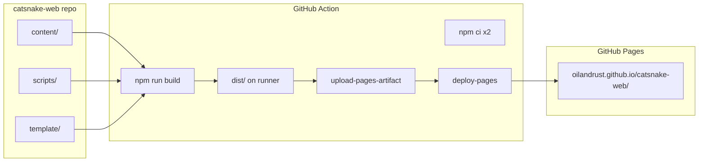

# catsnake-web GitHub Pages Deployment

## Goal

Stand up the full publish pipeline in [catsnake-web](https://github.com/oilandrust/catsnake-web): vault notes in `content/`, build scripts + React template in-repo, GitHub Action builds `dist/` on push and deploys to GitHub Pages. **`dist/` is never committed** — it is built in CI and uploaded as a Pages artifact.

## Target repo layout

```
catsnake-web/
  content/                  # vault notes (already present)
  scripts/                  # copied from obsidian-github-publish
  template/                 # Vite React app (source only)
  .github/workflows/
    deploy.yml
  package.json
  package-lock.json
  .gitignore                # includes dist/, node_modules/, generated assets
```

**Not in git:** `dist/`, `node_modules/`, `template/node_modules/`, `template/public/data/site-data.json`, `template/public/assets/`

## Architecture



## Step 1: Update build output to `dist/` at repo root

Two small changes in the source tooling ([obsidian-github-publish](obsidian-github-publish)), then copy to catsnake-web:

**[template/vite.config.ts](template/vite.config.ts)** — add `build.outDir`:

```ts
export default defineConfig({
  plugins: [react()],
  base: process.env.VITE_BASE_PATH || '/',
  build: {
    outDir: '../dist',
    emptyOutDir: true,
  },
});
```

**[scripts/build-site.mjs](scripts/build-site.mjs)** — update the success log from `template/dist` to `ROOT_DIR/dist`.

This keeps generated site output at repo root, which is what the GitHub Action will upload.

## Step 2: Copy toolchain into catsnake-web

Copy from obsidian-github-publish into `/Users/olivier/Projects/catsnake-web/`:

| Source | Destination |
|--------|-------------|
| `scripts/` | `scripts/` |
| `template/` (exclude `node_modules/`, `dist/`, `public/data/`, `public/assets/`) | `template/` |
| `package.json` + `package-lock.json` | root |
| `template/package-lock.json` | `template/` |

## Step 3: catsnake-web `package.json` scripts

Tailor root [package.json](package.json) for the published repo:

```json
{
  "scripts": {
    "build": "node scripts/build-site.mjs --content ./content --site-name \"Cat Snake\" --base-path /catsnake-web/",
    "dev": "node scripts/build-site.mjs --content ./content --site-name \"Cat Snake\" --base-path / --skip-vite && npm run dev --prefix template",
    "preview": "npm run preview --prefix template"
  }
}
```

- `--content ./content` — notes live in-repo
- `--base-path /catsnake-web/` — required for project Pages URL `https://oilandrust.github.io/catsnake-web/`

## Step 4: `.gitignore` for catsnake-web

```
node_modules/
template/node_modules/
dist/
template/public/data/site-data.json
template/public/assets/
.DS_Store
```

## Step 5: GitHub Actions workflow

Create `.github/workflows/deploy.yml` (pattern from [portfolio-psy/.github/workflows/deploy.yml](/Users/olivier/Projects/portfolio-psy/.github/workflows/deploy.yml)):

```yaml
name: Deploy to GitHub Pages

on:
  push:
    branches: [main]
  workflow_dispatch:

permissions:
  contents: read
  pages: write
  id-token: write

concurrency:
  group: pages
  cancel-in-progress: false

jobs:
  build:
    runs-on: ubuntu-latest
    steps:
      - uses: actions/checkout@v4

      - uses: actions/setup-node@v4
        with:
          node-version: '20'
          cache: npm
          cache-dependency-path: |
            package-lock.json
            template/package-lock.json

      - run: npm ci
      - run: npm ci --prefix template
      - run: npm run build

      - uses: actions/configure-pages@v4

      - uses: actions/upload-pages-artifact@v3
        with:
          path: ./dist

  deploy:
    needs: build
    runs-on: ubuntu-latest
    environment:
      name: github-pages
      url: ${{ steps.deployment.outputs.page_url }}
    steps:
      - id: deployment
        uses: actions/deploy-pages@v4
```

Key difference from portfolio-psy: artifact path is `./dist` (not `./out`), and two `npm ci` runs (root + template).

## Step 6: Git push (force push)

Local catsnake-web state: `origin` → `https://github.com/oilandrust/catsnake-web.git`, no local commits yet, `content/` untracked. Remote has one placeholder commit with a `Readme` file.

**Strategy (confirmed): force push** to replace the placeholder:

```bash
cd /Users/olivier/Projects/catsnake-web
git add content/ scripts/ template/ .github/ package.json package-lock.json template/package-lock.json .gitignore
git commit -m "Add publish toolchain and vault content"
git push -u origin main --force
```

No `Readme` committed — replaces remote placeholder entirely.

## Step 7: GitHub repo settings (manual, one-time)

In [github.com/oilandrust/catsnake-web/settings/pages](https://github.com/oilandrust/catsnake-web/settings/pages):

- **Source:** GitHub Actions (not "Deploy from a branch")
- After first successful workflow run, site will be live at `https://oilandrust.github.io/catsnake-web/`

## Step 8: Verify locally before push

```bash
cd /Users/olivier/Projects/catsnake-web
npm install && npm install --prefix template
npm run build
npm run preview   # check http://localhost:4173
```

Confirm:
- `dist/` created at repo root (not `template/dist/`)
- 12 notes + assets from `content/`
- Hash routes work with base path

## What stays in obsidian-github-publish

Update the same `vite.config.ts` and `build-site.mjs` changes in the dev repo for consistency. Its `package.json` can keep `build:demo` pointing at catsnake-web for local iteration, but with the new `outDir` the demo build will also write to `obsidian-github-publish/dist/` when run from that repo — acceptable, or add a `--out-dir` flag later if needed.

## Out of scope

- Obsidian plugin onboarding
- Committing `dist/` to the repo
- Custom domain setup
