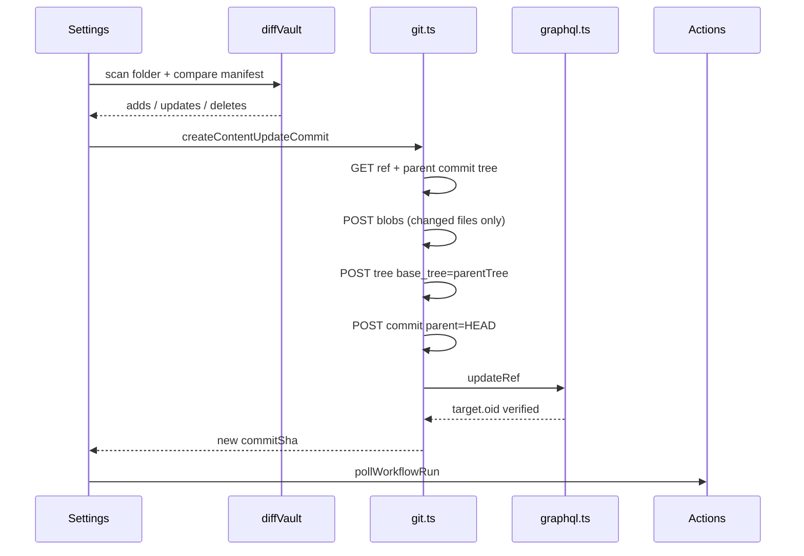

# Incremental "Publish Changes" workflow

## Goal

When a site is already published, opening **Settings → GitHub Publish** should:

1. Scan the configured vault folder and compare against the stored `manifest`
2. Show **up to date** or **N unpublished changes** (with a short summary)
3. Offer **Publish changes** (only when there are changes) — no separate "Full republish" on the published settings view (per your preference)

Publishing uses the **Git Database API `base_tree` pattern** already described in [Wiki/Publish Architecture.md](Wiki/Publish Architecture.md) — not a full tree rebuild.



## Git API workflow (incremental)

Matches architecture section **Re-publish flow** and **Git Database API** in [Wiki/Publish Architecture.md](Wiki/Publish Architecture.md):

| Step | API | Notes |
|------|-----|-------|
| 1 | `GET /git/ref/heads/main` | Parent commit SHA |
| 2 | `GET /git/commits/{parent}` | Parent **tree** SHA (`tree.sha`) |
| 3 | `POST /git/blobs` | Only for **added/updated** `content/**` files |
| 4 | `POST /git/trees` | `{ base_tree: parentTreeSha, tree: [...] }` |
| 5 | `POST /git/commits` | `{ tree, parents: [parentSha], message }` |
| 6 | GraphQL `updateRef` | Existing [`updateBranchRefGraphQL`](plugin/src/github/graphql.ts) path |

**Tree entries:**

- **Add/update:** `{ path: "content/…", mode: "100644", type: "blob", sha: blobSha }`
- **Delete:** `{ path: "content/…", mode: "100644", type: "blob", sha: null }`

**Not touched on incremental publish:** toolchain (`scripts/`, `template/`, `.github/`), Pages setup — already enabled after first publish.

**Concurrency:** On `409` during commit/tree creation, re-fetch HEAD + parent tree and retry once (architecture "Concurrency / conflicts" section).

**Commit message:** `Publish vault updates` (+ optional file count suffix).

## Change detection

Extract shared logic from [`initialPublish.ts`](plugin/src/publish/initialPublish.ts) into a new module [`plugin/src/publish/diffVault.ts`](plugin/src/publish/diffVault.ts):

- `hashFileContent(bytes)` — move existing `hashBytes` here (keep `hash:…` format for backward compatibility with saved manifests)
- `buildContentManifest(files: RepoFile[])` — `content/**` paths only
- `diffAgainstManifest(manifest, scannedFiles)` → `{ adds, updates, deletes, unchanged }`
  - **Add:** path not in manifest
  - **Update:** path in manifest, hash differs
  - **Delete:** path in manifest, absent from scan
  - Renames appear as delete + add (path-keyed manifest; acceptable for v1)

[`scanVaultFolder`](plugin/src/publish/scanVault.ts) stays the single source of truth for which local files are publishable.

**Settings-time check** (async, like existing live-status checks in [`main.ts`](plugin/main.ts)):

- On `renderPublishedSite`, after rendering summary, run `scanVaultFolder` + `diffAgainstManifest`
- Show `Checking for changes…` → `Up to date` or `3 changes (2 updated, 1 added)`
- Enable **Publish changes** only when `adds + updates + deletes > 0`
- Use `statusCheckId`-style guard to ignore stale results if settings re-rendered

No remote HEAD comparison in v1 (manifest is local source of truth). Optional follow-up: warn if `GET ref` SHA ≠ `lastPublishedCommitSha`.

## Publish pipeline

New [`plugin/src/publish/publishChanges.ts`](plugin/src/publish/publishChanges.ts):

```typescript
runPublishChanges(app, token, username, settings, onProgress) → PublishResult
```

Steps:

1. Re-scan + diff (safety check; abort with notice if empty)
2. `createContentUpdateCommit(...)` in [`git.ts`](plugin/src/github/git.ts) — new exported function
3. Merge manifest: remove deletes, update hashes for adds/updates
4. Return `{ owner, repo, commitSha, manifest, liveUrl }` (same shape as initial publish)

Wire in [`startPublish.ts`](plugin/src/publish/startPublish.ts):

- `startPublishChanges(plugin)` — opens `ProgressModal`, updates `lastPublishedCommitSha` + `manifest` on success
- Keep `startPublish` for **first-time** publish via wizard / saved setup only

## Progress UI (hideable wizard)

Reuse [`ProgressModal`](plugin/src/ui/ProgressModal.ts) with a `mode: 'incremental'` option:

| Phase | Label |
|-------|-------|
| `preparing` | Detect changes |
| `uploading` | Upload changed files |
| `uploading` (substep) | Create Git commit |
| `waiting-build` | Build site |
| `waiting-deploy` | Deploy to Pages |
| `done` | Site is live |

**Skip** `configuring-pages` on incremental runs.

Existing **Run in background** button already closes the modal while work continues — keep and rename helper text to make intent clearer (e.g. "Continue in background"). Optional: `Notice` when backgrounded with link to Actions.

Replace **Publish again** in published settings with **Publish changes** (disabled when up to date).

Add command palette: **GitHub Publish: Publish changes**.

## Files to change

| File | Change |
|------|--------|
| [`plugin/src/publish/diffVault.ts`](plugin/src/publish/diffVault.ts) | **New** — manifest build + diff |
| [`plugin/src/publish/publishChanges.ts`](plugin/src/publish/publishChanges.ts) | **New** — incremental publish runner |
| [`plugin/src/github/git.ts`](plugin/src/github/git.ts) | **Add** `createContentUpdateCommit` (base_tree flow) |
| [`plugin/src/publish/initialPublish.ts`](plugin/src/publish/initialPublish.ts) | Use shared manifest helpers from `diffVault` |
| [`plugin/src/publish/startPublish.ts`](plugin/src/publish/startPublish.ts) | Add `startPublishChanges` |
| [`plugin/main.ts`](plugin/main.ts) | Change detection UI + Publish changes button |
| [`plugin/src/ui/ProgressModal.ts`](plugin/src/ui/ProgressModal.ts) | `incremental` mode steps |
| [`plugin/styles.css`](plugin/styles.css) | Style for change-status line (reuse status classes) |

## UX summary (published site settings)

```
Published site
  Site name: Publish
  Vault folder: obsidian-github-publish/Wiki
  Repository: [link]  Live — Repository reachable
  Live site: [link]   Live — Site is live
  Changes: 2 updated, 1 added        ← new
  [ Publish changes ]                  ← enabled only if changes > 0
```

## Out of scope (follow-ups)

- Full republish from settings (use setup wizard if ever needed)
- Toolchain/template update command
- sha256 manifest (current `hash:` format is fine for v1)
- Remote manifest reconciliation if repo edited on GitHub directly
