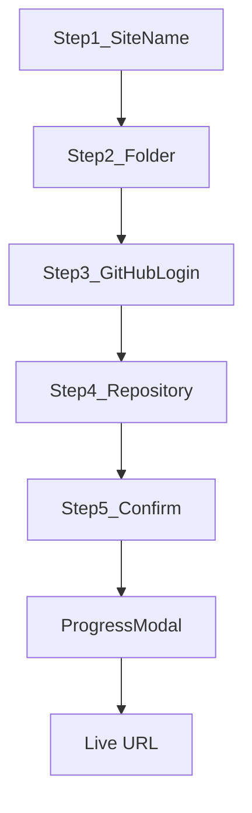

# GitHub Publish — Obsidian Plugin Prototype

## Scope

**In scope:** First-time setup wizard + initial publish + Actions progress monitoring.

**Out of scope (later):** Re-publish with diff/manifest updates, template upgrade command, wikilink asset resolution beyond folder scan.

Follows [Wiki/Publish Architecture.md](Wiki/Publish%20Architecture.md): Git Database API, direct push to `main`, no system git.

## Plugin location and layout

New directory: [`plugin/`](plugin/) at repo root (sibling to `scripts/`, `template/`).

```
plugin/
  manifest.json
  package.json
  esbuild.config.mjs
  tsconfig.json
  styles.css
  main.ts
  src/
    github/
      auth.ts          # Device Flow
      client.ts        # requestUrl wrapper + types
      git.ts           # blobs → tree → commit → ref
      repos.ts         # create/list repos
      pages.ts         # PUT pages build_type workflow
      actions.ts       # poll workflow runs
    publish/
      scanVault.ts     # walk selected TFolder → FileEntry[]
      bundleToolchain.ts
      initialPublish.ts
    ui/
      SetupModal.ts    # multi-step wizard
      ProgressModal.ts
    settings.ts        # PluginSettings + save/load
  assets/
    toolchain/         # synced from repo root at build time
```

Add a root script `npm run sync:toolchain` to copy `scripts/`, `template/` (source only), `package-lock.json` files, `.gitignore`, and `deploy.yml` from [catsnake-web](https://github.com/oilandrust/catsnake-web) pattern into `plugin/assets/toolchain/`.

## Setup wizard (modal steps)



| Step | UI | Logic |
|------|-----|-------|
| 1. Site name | Text input | Used in generated `package.json` `--site-name` |
| 2. Folder | `FolderSuggest` filtered to vault folders | Store vault-relative path e.g. `Design` |
| 3. GitHub login | "Connect to GitHub" button + device code display | Device Flow; store token in `saveData` |
| 4. Repository | Toggle: create new / use existing; repo name or dropdown | `POST /user/repos` or pick from `GET /user/repos` |
| 5. Confirm | Summary: site name, folder, repo, file count | "Publish" triggers `initialPublish` |
| Progress | Step list with spinners/checkmarks | Upload phases + Actions poll |

Command palette entry: **GitHub Publish: Set up site** → opens wizard. Ribbon icon optional.

## GitHub Device Flow auth

Requires a **GitHub OAuth App** (user or developer registers once; `client_id` stored in plugin settings with a default placeholder).

1. `POST https://github.com/login/device/code` — `client_id`, `scope: repo`
2. Show `user_code` + open `verification_uri` via `window.open`
3. Poll `POST https://github.com/login/oauth/access_token` every 5s until `access_token` or timeout
4. `GET /user` to display logged-in username; store token in plugin data

All HTTP via Obsidian [`requestUrl`](https://docs.obsidian.md/Reference/TypeScript+API/requestUrl) (no CORS issues).

Plugin settings page (Obsidian settings tab): OAuth App `client_id` field + "Disconnect GitHub" button.

## Initial publish pipeline

[`src/publish/initialPublish.ts`](plugin/src/publish/initialPublish.ts) orchestrates:

1. **Scan vault folder** — [`scanVault.ts`](plugin/src/publish/scanVault.ts) recursively reads files via `vault.adapter.readBinary` / `read`; mirror rules from [`scripts/lib/scan-content.mjs`](scripts/lib/scan-content.mjs) (include md/images/pdf/mp3; skip `.canvas`, `*.excalidraw.md`, `.obsidian`)
2. **Map to repo paths** — `content/{relativePath}` e.g. vault folder `Design/specs.md` → `content/Design/specs.md`
3. **Bundle toolchain** — read files from `plugin/assets/toolchain/`; generate `package.json` from template with `--site-name` and `--base-path /{repo}/`
4. **Create or verify repo** — `POST /user/repos` (`auto_init: false`) for new; for existing, `GET /repos/{owner}/{repo}` and warn if not empty (prototype: block non-empty repos)
5. **Enable Pages** — `PUT /repos/{owner}/{repo}/pages` `{ "build_type": "workflow" }`
6. **Git commit** — [`git.ts`](plugin/src/github/git.ts):
   - Create blob per file (base64 for binary, utf-8 for text)
   - `POST /git/trees` (no `base_tree` for first commit)
   - `POST /git/commits` (no parents)
   - `POST /git/refs` `{ "ref": "refs/heads/main", "sha": commitSha }` (create branch on empty repo)
7. **Save settings** — `owner`, `repo`, `siteName`, `contentFolder`, `lastPublishedCommitSha`, initial `manifest` (path → sha256)
8. **Open ProgressModal** — poll Actions

### Large uploads

Batch blob creation sequentially with progress updates ("Uploading 12/46 files…"). catsnake-web (~46 files, ~32 MB) is within GitHub limits. Show error if any file exceeds 100 MB.

## Progress modal

[`src/ui/ProgressModal.ts`](plugin/src/ui/ProgressModal.ts) shows phases:

1. Preparing files
2. Creating repository
3. Configuring GitHub Pages
4. Uploading to GitHub
5. Waiting for build job (~20s)
6. Waiting for deploy job (~1–5 min)
7. Done — show `https://{owner}.github.io/{repo}/` with "Open site" button

Poll [`actions.ts`](plugin/src/github/actions.ts):

```
GET /repos/{owner}/{repo}/actions/runs?branch=main&event=push
```

Match `head_sha` to commit SHA; poll every 8s until `status === completed`. Show `conclusion` success/failure with link to run URL on failure.

## Key files to create

| File | Purpose |
|------|---------|
| [`plugin/manifest.json`](plugin/manifest.json) | `id: github-publish`, `name: GitHub Publish`, `minAppVersion: 1.5.0` |
| [`plugin/main.ts`](plugin/main.ts) | `Plugin` subclass, register command + settings tab |
| [`plugin/src/github/client.ts`](plugin/src/github/client.ts) | Typed `githubRequest(token, method, path, body?)` |
| [`plugin/src/github/git.ts`](plugin/src/github/git.ts) | `createCommitFromFiles(owner, repo, files, message)` |
| [`plugin/src/ui/SetupModal.ts`](plugin/src/ui/SetupModal.ts) | `Modal` with step state machine |
| [`plugin/esbuild.config.mjs`](plugin/esbuild.config.mjs) | Bundle TS → `main.js`; copy `assets/` to output |

## Toolchain sync

Add [`scripts/sync-toolchain.mjs`](scripts/sync-toolchain.mjs) and root npm script:

```bash
node scripts/sync-toolchain.mjs   # copies scripts/, template/src, template configs, lockfiles, deploy.yml → plugin/assets/toolchain/
```

Fetch `deploy.yml` from validated [catsnake-web workflow](https://github.com/oilandrust/catsnake-web/blob/main/.github/workflows/deploy.yml) content (also add a copy at `plugin/assets/toolchain/.github/workflows/deploy.yml` in repo).

`package.json.template` in assets:

```json
{
  "scripts": {
    "build": "node scripts/build-site.mjs --content ./content --site-name \"{{siteName}}\" --base-path /{{repo}}/"
  }
}
```

## Developer workflow

```bash
npm run sync:toolchain          # refresh bundled assets
cd plugin && npm install
npm run build                   # esbuild → main.js
```

Symlink or copy `plugin/` into vault `.obsidian/plugins/github-publish/` for testing.

**Prerequisite:** Create a GitHub OAuth App (no client secret needed for device flow) with `repo` scope; enter `client_id` in plugin settings.

## Testing checklist

- [ ] Device Flow login succeeds
- [ ] Create new empty repo + initial commit with content + toolchain
- [ ] Pages API sets `build_type: workflow`
- [ ] Actions workflow triggers and progress modal reaches "Live"
- [ ] Site loads at `https://{user}.github.io/{repo}/`
- [ ] Settings persist across Obsidian restart

## Future (not this PR)

- Re-publish command with manifest diff ([Publish Architecture.md](Wiki/Publish%20Architecture.md) re-publish flow)
- Wikilink asset inclusion during scan
- Handle non-empty existing repos (merge or overwrite confirm)
