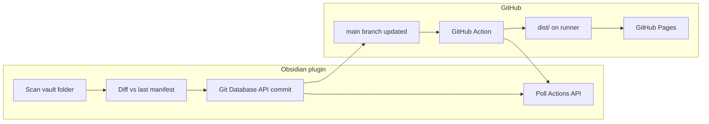

# Publish Architecture

How the Obsidian plugin should initialize and update a published site. Complements [Publishing Steps Specifications.md](Publishing%20Steps%20Specifications.md) (manual validation on catsnake-web) and [MVP.md](MVP.md) (product goals).

## Design goals

- Publish from Obsidian with **no system git required**
- One user action → notes on GitHub → GitHub Actions builds and deploys
- Match the validated pipeline: `content/` + toolchain in repo, `dist/` built in CI only
- Target latency: commit in seconds; full deploy ~1–5 minutes (CI + Pages propagation)

## Recommended approach

Use the **GitHub Git Database API** to create commits directly over HTTPS. Do **not** shell out to `git`, and do **not** bundle git binaries in the plugin.

| Approach | Verdict |
|----------|---------|
| System `git` | Rejected — not installed for many users; credential setup varies |
| `isomorphic-git` / `dugite` | Rejected — large bundle, platform complexity, redundant with GitHub API |
| **Git Database API** | **Chosen** — atomic commits, deletes, no local git, triggers Actions on `main` |
| Contents API (`PUT .../contents/{path}`) | Avoid for vault publishes — one request per file, awkward deletes and batching |

### Direct push vs PR

| Phase | Mechanism |
|-------|-----------|
| **Onboarding** (first publish) | Direct commit to `main` (default) |
| **Re-publish** (note updates) | Direct commit to `main` |
| **Optional advanced** | PR + merge — only if user enables “review before publish” or repo has branch protection |

PR + merge was considered in early MVP notes. For a solo publisher clicking **Publish**, direct push is faster and sufficient. PR remains an optional future mode.

## What triggers deployment

The workflow in `.github/workflows/deploy.yml` runs on **push to `main`**:

```yaml
on:
  push:
    branches: [main]
```

Every publish must end with a **new commit on `main`**. The plugin does not build or upload `dist/` — CI does that after the push.



## Authentication

Use **GitHub OAuth** (OAuth App or GitHub App) with PKCE or device flow from the Obsidian desktop plugin.

### Required scopes

| Scope | Purpose |
|-------|---------|
| `repo` | Read/write repository contents, refs, Actions status (classic PAT / OAuth) |
| `workflow` | Update `.github/workflows/*` when landing commits on `main` (required for GraphQL `updateRef` on publish commits that include `deploy.yml`) |

Device flow requests both scopes: `repo workflow`. If you connected before `workflow` was added, **disconnect and sign in again** so GitHub issues a new token with the updated scopes.

For a **GitHub App**, use fine-grained permissions equivalent to: Contents (read/write), **Workflows (read/write)**, Metadata (read), Pages (read/write), Actions (read).

Store the token securely in plugin settings (Obsidian `loadData` / OS keychain if available). Never commit tokens.

## Plugin state (per site)

Persist after onboarding:

```json
{
  "owner": "oilandrust",
  "repo": "catsnake-web",
  "siteName": "Cat Snake",
  "defaultBranch": "main",
  "lastPublishedCommitSha": "abc123...",
  "manifest": {
    "content/Design/specs.md": "sha256:...",
    "content/Design/Art/cat.png": "sha256:..."
  }
}
```

The **manifest** maps repo-relative paths to content hashes. On publish, diff local files against the manifest to determine adds, updates, and deletes.

## Onboarding flow

Maps to MVP onboarding steps 1–6.

1. **Choose folder** — user selects vault folder to publish
2. **Choose site name** — used in `package.json` `--site-name` and UI title
3. **Authenticate** — OAuth; store token
4. **Create or choose repository**

   ```
   POST /user/repos
   ```

   ```json
   {
     "name": "my-site",
     "private": false,
     "auto_init": false
   }
   ```

   If using an existing repo, verify it is empty or confirm overwrite policy.

5. **Build initial file set** locally in memory:
   - `content/**` — copy from selected vault folder (preserve paths, include linked assets)
   - `scripts/`, `template/`, `.github/workflows/deploy.yml`, `package.json`, `package-lock.json`, `template/package-lock.json`, `.gitignore` — bundled inside the plugin

   Generate `package.json` scripts with correct `--site-name` and `--base-path /{repo}/`.

6. **Enable GitHub Pages (Actions source)** — **before** pushing, so `configure-pages` in the workflow can succeed:

   ```
   POST /repos/{owner}/{repo}/pages
   ```

   ```json
   { "build_type": "workflow" }
   ```

   Ref: [REST API — Create a GitHub Pages site](https://docs.github.com/en/rest/pages/pages#create-a-apiname-pages-site)

7. **Create initial commit** via Git Database API (see below) on `main` — triggers the deploy workflow
8. **Poll deployment** until Actions workflow for that commit succeeds
9. **Show live URL:** `https://{owner}.github.io/{repo}/`

## Re-publish flow (updates)

Triggered by command palette: **Publish to GitHub** (or similar).

1. Scan the configured vault folder
2. Build candidate `content/**` paths (same rules as build script: include `.md`, images, pdf, mp3; exclude `.obsidian`, `.canvas`, etc.)
3. Diff against `manifest`:
   - **Add** — new path
   - **Update** — path exists, hash changed
   - **Delete** — path in manifest but no longer in local publish set
4. If no changes → notify user “Already up to date”
5. Create one commit via Git Database API (only `content/` changes in normal re-publishes)
6. Update `manifest` and `lastPublishedCommitSha` on success
7. Poll Actions; show progress (build ~20 s, deploy ~1–5 min)

**Toolchain updates** (new template/script versions) are a separate command — **Update site template** — that commits `scripts/`, `template/`, and workflow files without mixing into every note publish.

## Git Database API — creating a commit

All endpoints: `https://api.github.com`. Auth header: `Authorization: Bearer {token}`.

### 1. Get parent commit

```
GET /repos/{owner}/{repo}/git/ref/heads/{branch}
```

Returns `object.sha` — the current tip of `main`.

If the repo is empty (no commits), skip parent and create the first commit without `parents`.

For a non-empty repo:

```
GET /repos/{owner}/{repo}/git/commits/{parent_sha}
```

Keep `parent_sha` and the parent tree SHA (`tree.sha`) for concurrency handling.

### 2. Create blobs for changed files

For each file to add or update:

```
POST /repos/{owner}/{repo}/git/blobs
```

```json
{
  "content": "{base64-encoded file contents}",
  "encoding": "base64"
}
```

Returns `sha` per blob. Text files may use `"encoding": "utf-8"` with raw string content instead.

### 3. Build tree

```
POST /repos/{owner}/{repo}/git/trees
```

```json
{
  "base_tree": "{parent_tree_sha}",
  "tree": [
    { "path": "content/Design/specs.md", "mode": "100644", "type": "blob", "sha": "{blob_sha}" },
    { "path": "content/old-note.md", "mode": "100644", "type": "blob", "sha": null }
  ]
}
```

- `mode`: `100644` for files, `100755` for executables, `040000` for directories (usually implicit via paths)
- Set `sha: null` to **delete** a path that existed in the parent tree

For the **initial commit**, omit `base_tree` and list the full tree.

### 4. Create commit

```
POST /repos/{owner}/{repo}/git/commits
```

```json
{
  "message": "Publish vault updates",
  "tree": "{new_tree_sha}",
  "parents": ["{parent_commit_sha}"]
}
```

Omit `parents` for the very first commit on an empty repo.

### 5. Update branch ref (push)

**Obsidian plugin:** REST `PATCH` on refs is unreliable inside Obsidian’s `requestUrl`, so the plugin uses **GraphQL `updateRef`** with the ref’s `node_id` and the new commit OID. Commits that include `.github/workflows/deploy.yml` require the OAuth **`workflow`** scope at this step (Git may return a generic “does not have the correct permissions to execute `UpdateRef`” error if it is missing).

**Reference (REST):**

```
PATCH /repos/{owner}/{repo}/git/refs/heads/{branch}
```

```json
{
  "sha": "{new_commit_sha}",
  "force": false
}
```

This fast-forwards `main` and triggers the deploy workflow.

### Concurrency / conflicts

If another push happened between step 1 and step 5 (409 response):

1. Re-fetch parent commit SHA and tree
2. Rebuild tree on top of latest `base_tree`
3. Retry commit + ref update

### Large repositories

- GitHub file limit: **100 MB per file**
- catsnake-web validation: ~32 MB total, 34 assets — well within limits
- For large first pushes, a single tree commit avoids the HTTP buffer issues seen with raw `git push`

## Optional: PR-based publish

Use only when the user opts in or `main` is protected.

1. Create branch: `POST /repos/{owner}/{repo}/git/refs` with `ref: refs/heads/publish-{timestamp}`
2. Point branch to new commit (same Git Database steps, but update the feature ref instead of `main`)
3. `POST /repos/{owner}/{repo}/pulls` — open PR into `main`
4. `PUT /repos/{owner}/{repo}/pulls/{n}/merge` — merge (requires merge permissions)
5. Merge triggers the same Actions workflow as a direct push

Adds latency and API calls. Not the default path.

## Monitoring deployment

After updating `main`, poll until the deploy workflow completes.

### List recent runs

```
GET /repos/{owner}/{repo}/actions/runs?branch=main&event=push
```

Find the run whose `head_sha` matches the new commit SHA.

### Get run status

```
GET /repos/{owner}/{repo}/actions/runs/{run_id}
```

| `status` | `conclusion` | Plugin UI |
|----------|--------------|-----------|
| `queued` / `in_progress` | `null` | “Building…” |
| `completed` | `success` | “Live at {url}” |
| `completed` | `failure` | Show link to Actions logs |

### Expected timing (from catsnake-web validation)

| Job | Duration |
|-----|----------|
| build | ~19 s |
| deploy | ~1–5 min |
| **Total** | **~2–5 min** |

Poll every 5–10 seconds. Show indeterminate progress during the deploy job (Pages propagation is not instant).

## Bundled plugin assets

Ship inside the plugin package (not read from the user’s vault):

```
plugin/
  assets/
    toolchain/
      scripts/
      template/          # source only, no node_modules
      .github/workflows/deploy.yml
      package.json.template
      package-lock.json
      template/package-lock.json
      .gitignore
```

At onboarding, interpolate `package.json.template` with `{siteName}`, `{repoName}`, `{basePath}`.

## File selection rules (content/)

Mirror [scripts/lib/scan-content.mjs](../scripts/lib/scan-content.mjs):

**Include:** `.md`, `.png`, `.jpg`, `.jpeg`, `.gif`, `.webp`, `.pdf`, `.mp3`

**Exclude:** `.git`, `.obsidian`, `.DS_Store`, `.canvas`, `*.excalidraw.md` (warn user)

**Wikilinks:** resolve `![[asset]]` and copy referenced files into `content/` relative to the published note, same as the build script expects.

## Commands (plugin UX)

| Command | When | API action |
|---------|------|------------|
| **Set up GitHub Publish** | First time | Create repo, Pages config, initial commit |
| **Publish to GitHub** | User edited notes | Diff `content/`, commit to `main`, poll CI |
| **Update site template** | New plugin version | Commit toolchain files only |
| **Open live site** | Anytime | Open `https://{owner}.github.io/{repo}/` |
| **View publish status** | After publish | Open Actions run URL |

## Decisions log

| Question | Decision | Rationale |
|----------|----------|-----------|
| Local git required? | No | Git Database API over HTTPS |
| Direct push or PR? | Direct push default | Faster; matches “publish in 60s”; user owns repo |
| Commit `dist/`? | No | Built in CI; see Publishing Steps Specifications |
| Contents API or Git API? | Git Database API | Atomic multi-file commits, proper deletes |
| When to update toolchain? | Separate command | Decouple note edits from template upgrades |

## References

- [Publishing Steps Specifications.md](Publishing%20Steps%20Specifications.md) — validated manual/CI flow
- [GitHub Git Database API](https://docs.github.com/en/rest/git)
- [GitHub Pages REST API](https://docs.github.com/en/rest/pages)
- [GitHub Actions REST API](https://docs.github.com/en/rest/actions)
- Live example: https://github.com/oilandrust/catsnake-web
