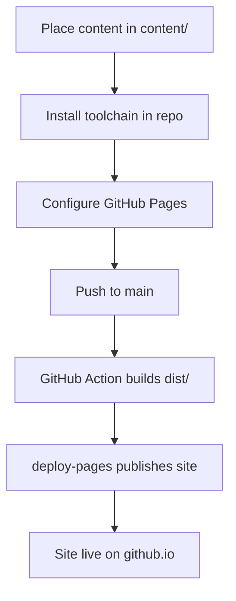

# Publishing a Site to GitHub Pages

Reference implementation: [oilandrust/catsnake-web](https://github.com/oilandrust/catsnake-web) → https://oilandrust.github.io/catsnake-web/

This documents the exact steps validated in June 2026. The Obsidian plugin should automate all of these. See [Publish Architecture.md](Publish%20Architecture.md) for the plugin API and update strategy.

## Target repository layout

```
my-site-repo/
  content/                  # published vault notes + assets
  scripts/                  # build-site.mjs + lib/
  template/                 # Vite + React SPA (source only)
  .github/workflows/
    deploy.yml
  package.json
  package-lock.json
  template/package-lock.json
  .gitignore
```

**Not committed to git:** `dist/`, `node_modules/`, `template/node_modules/`, `template/public/data/site-data.json`, `template/public/assets/`

`dist/` is built in CI and uploaded as a Pages artifact. It never lives in the repository.

## End-to-end flow



## Step 1 — Place content in the repository

Copy the chosen vault folder into `content/` at the repo root, preserving subfolders and assets (images, PDFs, audio, etc.).

Example: vault notes that lived at the repo root were moved to `content/Design/`, `content/DevLog/`, etc.

The build script reads from `--content ./content`.

## Step 2 — Install the publish toolchain

Copy these from the obsidian-github-publish project into the target repository:

| Item | Purpose |
|------|---------|
| `scripts/` | Scans content, parses markdown, copies assets, runs Vite build |
| `template/` | React SPA (exclude `node_modules/`, `dist/`, generated `public/data/` and `public/assets/`) |
| `package.json` | Root build dependencies (`marked`, `js-yaml`) and npm scripts |
| `package-lock.json` | Reproducible CI installs |
| `template/package-lock.json` | Reproducible template CI installs |
| `.gitignore` | Excludes build artifacts and dependencies |
| `.github/workflows/deploy.yml` | Build + deploy on push |

### Root `package.json` scripts (per-repo)

Tailor `--site-name` and `--base-path` to the repository:

```json
{
  "scripts": {
    "build": "node scripts/build-site.mjs --content ./content --site-name \"Cat Snake\" --base-path /catsnake-web/",
    "dev": "node scripts/build-site.mjs --content ./content --site-name \"Cat Snake\" --base-path / --skip-vite && npm run dev --prefix template",
    "preview": "npm run preview --prefix template"
  }
}
```

- `--base-path` must be `/{repo-name}/` for project Pages URLs (`https://{user}.github.io/{repo-name}/`).
- Vite writes output to repo-root `dist/` (configured via `template/vite.config.ts` → `build.outDir: '../dist'`).

### `.gitignore`

```
node_modules/
template/node_modules/
dist/
template/public/data/site-data.json
template/public/assets/
.DS_Store
```

## Step 3 — Configure GitHub Pages (manual today, plugin tomorrow)

These were done manually in the GitHub UI for catsnake-web. **The plugin should automate them via the GitHub API.**

### 3a. Enable GitHub Pages

In **Settings → Pages** for the repository:

- Ensure Pages is enabled for the repository.

### 3b. Set source to GitHub Actions

In **Settings → Pages**:

- **Build and deployment → Source:** select **GitHub Actions** (not "Deploy from a branch").

Without this, the `deploy-pages` job will not publish the site even if the workflow succeeds.

### Plugin automation notes

The plugin should call the GitHub API after creating or updating the repository:

```
PUT /repos/{owner}/{repo}/pages
```

Body:

```json
{
  "build_type": "workflow"
}
```

Required OAuth scopes: `repo` and `workflow` (or fine-grained equivalent with Contents + Workflows write and Pages write access).

If Pages is not yet enabled, the first workflow run with `actions/configure-pages@v4` will fail — enable Pages with `build_type: workflow` **before** pushing the commit that contains `deploy.yml`.

Reference: [GitHub REST API — Pages](https://docs.github.com/en/rest/pages/pages)

## Step 4 — Push to the repository

```bash
git add content/ scripts/ template/ .github/ package.json package-lock.json template/package-lock.json .gitignore
git commit -m "Add publish toolchain and vault content"
git push -u origin main
```

For a new repo that already has a placeholder commit (e.g. a default Readme), either:

- **Force push** to replace it entirely, or
- Merge unrelated histories, delete the placeholder file, then push normally.

Large repos (~30 MB of assets) may need a larger HTTP post buffer for the initial push:

```bash
git -c http.postBuffer=524288000 push origin main
```

## Step 5 — Monitor deployment progress

On every push to `main`, the workflow **Deploy to GitHub Pages** runs automatically.

Monitor at: `https://github.com/{owner}/{repo}/actions`

### What the workflow does

1. `npm ci` (root)
2. `npm ci --prefix template`
3. `npm run build` → writes `dist/` on the runner
4. `actions/upload-pages-artifact` uploads `dist/`
5. `actions/deploy-pages` publishes to GitHub Pages

### Expected timing (catsnake-web, first deploy)

| Job | Duration |
|-----|----------|
| build | ~19 s |
| deploy | ~4–5 min (first deploy; CDN propagation) |
| **Total** | **~5 min** |

Subsequent deploys may be faster, but the deploy job typically still takes 1–3 minutes.

### Success criteria

- Both jobs show green checkmarks in Actions.
- Site loads at `https://{user}.github.io/{repo-name}/`.
- Sidebar shows the folder tree; notes and assets render in the main pane.

## What the plugin must automate

Mapped to [MVP.md](MVP.md) onboarding:

| Step | Manual (catsnake-web) | Plugin should |
|------|----------------------|---------------|
| Choose folder to publish | Moved vault into `content/` by hand | Copy selected vault folder to `content/` in the target repo |
| Choose site name | Hardcoded in `package.json` `--site-name` | Generate `package.json` with user's site name |
| Authenticate with GitHub | Used existing `gh` / git credentials | OAuth app with `repo` + `workflow` scopes |
| Create or choose repository | Created `oilandrust/catsnake-web` | GitHub API: create repo or use existing |
| Install toolchain | Copied scripts, template, workflow, gitignore | Commit all toolchain files via PR |
| Enable GitHub Pages | Settings → Pages → enable | `PUT /repos/{owner}/{repo}/pages` with `build_type: workflow` |
| Set source to GitHub Actions | Settings → Pages → GitHub Actions | Same API call |
| Push and publish | `git push origin main` | Create PR, merge, or push directly |
| Monitor progress | Watched Actions tab + `gh run watch` | Poll workflow run status via GitHub API; show progress in plugin UI |
| Site is live | Verified at github.io URL | Display final URL when deploy job succeeds |

## Local development (optional)

From the published repo:

```bash
npm install && npm install --prefix template
npm run build      # produces dist/ locally
npm run preview    # http://localhost:4173
```

Local preview uses `--base-path /` in the `dev` script. Production builds use `/{repo-name}/`.
